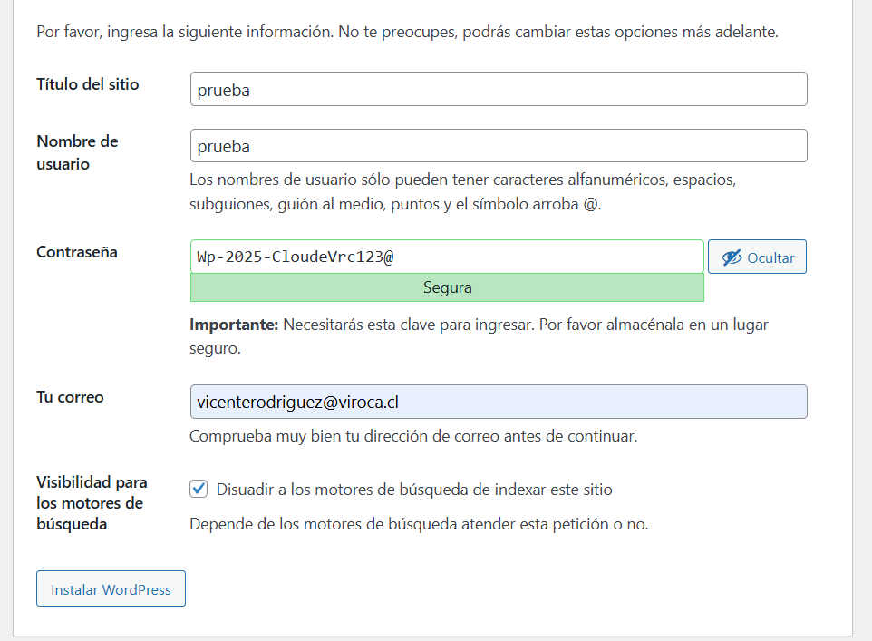
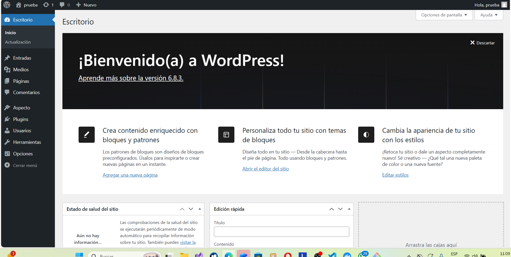

# Tarea de cloud

> Nombre : Vicente Rodriguez Cancino.

## Explicación del codigo
```yml

services:  ## iniciamos servicios
  db:    ## llamaremos contenedor db
    image: mariadb:11  # seleccionamos la imagen
    environment:  # Aca guardamos las credenciales de base de datos
      - MYSQL_ROOT_PASSWORD=1234567vrc
      - MYSQL_DATABASE=wordpressvrc
      - MYSQL_USER=wordpressvrc
      - MYSQL_PASSWORD=1234567vrc
    volumes:  # Creamos volumen db_data para la persistencia
      - db_data:/var/lib/mysql
    restart: on-failure  # Reinicio el codigo se reinicia solo si contiene un error de codigo
  wordpress: # llamaremos el contenedor wordpress 
    image: wordpress:6-apache  # con imagen wordpress:6-apache
    depends_on: # depende de db
      - db
    ports: # en el puerto 8082:80
      - "8082:80"
    environment: # aca tendremos  las credenciales de Wordpress 
      - WORDPRESS_DB_HOST=db
      - WORDPRESS_DB_USER=wordpressvrc
      - WORDPRESS_DB_PASSWORD=1234567vrc
      - WORDPRESS_DB_NAME=wordpressvrc
    volumes: # tendremos un volumen para wordpress
      - wordpress_data:/var/www/html
    restart: always  # y tendra un reinicio que se reinicia siempre
volumes: # el volumen de los tanto de base de datos como de worpress
  db_data:
  wordpress_data:

```


Configuracion:



Vista:
